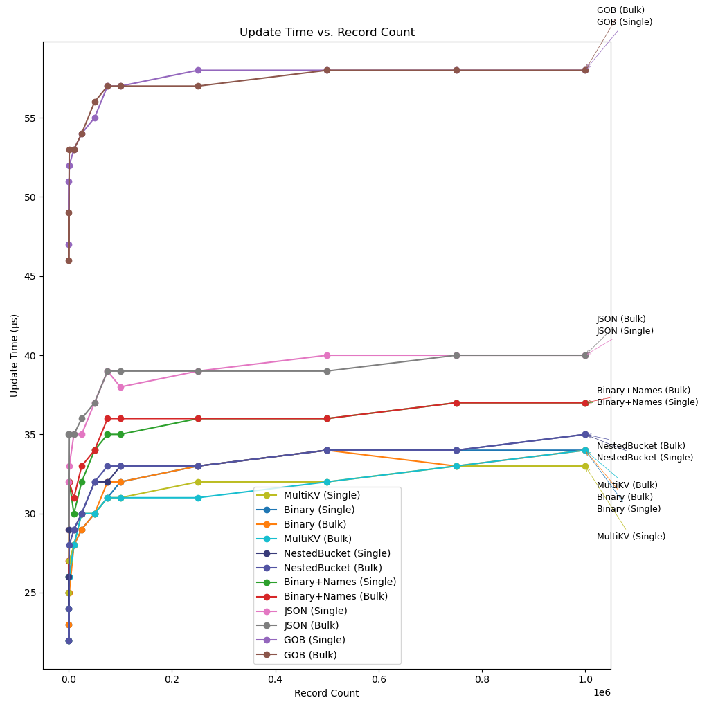
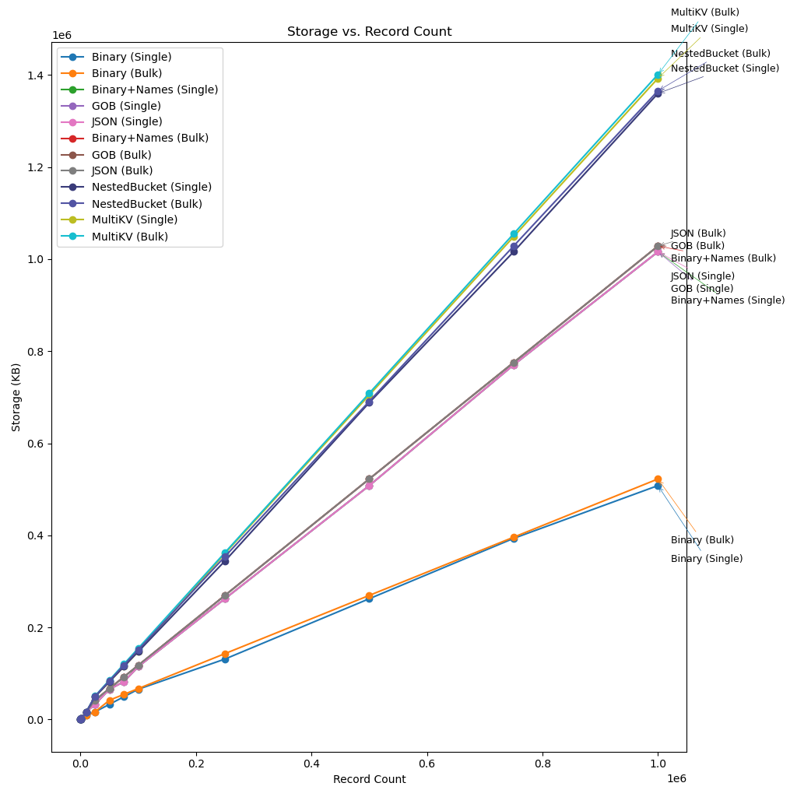

# BoltDB Benchmarks

This study evaluates different strategies for storing records in BoltDB and examines their performance trade-offs.

---

## Experiment Setup

Benchmarks were run at the following record counts:

* 10, 100, 1,000
* 10,000, 25,000, 50,000, 75,000
* 100,000, 250,000, 500,000, 750,000
* 1,000,000

Each scenario was repeated **10 times**, and results were averaged.
The full suite of tests required several hours to complete.

---

## Example Data

```go
func generateUser(id int64) *UserInfo {
	rand.Seed(id)
	return &UserInfo{
		ID:          id,
		Username:    fmt.Sprintf("user_%d", id),
		Email:       fmt.Sprintf("user%d@example.com", id),
		FirstName:   fmt.Sprintf("First_%d", id),
		LastName:    fmt.Sprintf("Last_%d", id),
		Age:         int32(rand.Intn(60) + 18),
		Height:      float32(150 + rand.Intn(50)),
		Weight:      float32(50 + rand.Intn(100)),
		Balance:     rand.Float64() * 10000,
		IsActive:    rand.Intn(2) == 1,
		CreatedAt:   time.Now().Unix() - int64(rand.Intn(365*24*3600)),
		UpdatedAt:   time.Now().Unix(),
		LoginCount:  int32(rand.Intn(1000)),
		Score:       rand.Float64() * 100,
		Description: fmt.Sprintf(
			"This is a description for user %d with some random text to make it longer and more realistic.",
			id,
		),
	}
}
```

---

## Storage Strategies Tested

Six encoding strategies were benchmarked:

* **Binary**

  * One KV pair per record.
  * Key = ID, Value = binary-encoded concatenation of fields.
  * Most storage-efficient representation.

* **Binary+Names**

  * One KV pair per record.
  * Value = alternating field names and values (no delimiters).
  * Mimics JSON/Gob layout but without structural markers.

* **JSON**

  * One KV pair per record.
  * Value = JSON serialization of struct.

* **Gob**

  * One KV pair per record.
  * Value = Gob serialization of struct.

* **MultiKV**

  * Multiple KV pairs per record:
    `ID1.Field1 → Value`
    `ID1.Field2 → Value`
    …

* **NestedBuckets**

  * One bucket per record, keyed by ID.
  * Each bucket contains field → value pairs.

For each strategy, two insertion modes were compared:

1. **Single** – one record per transaction.
2. **Bulk** – all records inserted in a single transaction.

This allows us to observe whether insertion method influences on-disk layout and subsequent performance.

---

## Tests Conducted

For each `(Strategy, Insertion Mode)` combination and database size `N`, the following tests were run:

* **Read** – fetch `N/2` random records, one per transaction.
* **ReadMany** – fetch `N/3` consecutive records from the midpoint, in a single transaction.
* **FieldSum** – compute the sum of a single field by iterating over all records.
* **Update** – update one field for `N/2` random records, one per transaction.
* **Storage** – measure on-disk database size.

All performance results (except storage) are reported as **time per record**, calculated as total time divided by number of records.

---

## Results

### Write


**Test description**
Insert records into the database.

* **Single**: one record per transaction.
* **Bulk**: all records inserted in a single transaction.

**Analysis**

* Inserting one record per transaction takes about 30–50 µs per record.
  In a typical web server, transactions usually insert <10 records, so performance will be closer to this case than to bulk.
* Inserting all records in a single transaction takes \~2–10 µs, except for NestedBucket and MultiKV.
* Too many keys or nested buckets severely degrade performance:

  * NestedBucket (Bulk): \~50 µs/record (worst).
  * MultiKV (Bulk): \~32 µs/record, similar to JSON (Single).
* Performance plateaus after \~1k records, then slightly worsens as the B+-tree deepens.
* Gob is consistently slower than JSON.
* Binary+Names ≈ JSON.
* Binary is the fastest.

---

### Read


**Test description**
Read `N/2` random records, one per transaction.

**Analysis**

* Gob is >3× slower than JSON (the next worst).
* Insert mode does not affect read performance.
* MultiKV ≈ NestedBuckets, since each lookup involves at most one sub-bucket.
* Binary is fastest.

---

### ReadMany


**Test description**
Read `N/3` consecutive records starting from the midpoint, in a single transaction.

**Analysis**

* Gob is \~3.75× slower than JSON.
* Insert mode has no effect.
* MultiKV and NestedBuckets diverge—NestedBuckets are penalized by sub-bucket indirection.
* MultiKV ≈ Binary. Surprisingly, MultiKV outperforms Binary+Names even though both store field names.
* Consecutive KV access is as efficient as tightly packed KV storage.

---

### FieldSum


**Test description**
Iterate over the entire database and compute the sum of a field, in a single transaction.

**Analysis**

* Gob remains the slowest.
* NestedBuckets ≈ MultiKV ≈ Binary when scanning for a single field.
* Binary performs as fast as MultiKV: deserializing the full record is cheap in this encoding.

---

### Update



**Test description**
Update a single field for `N/2` random records, one update per transaction.

**Analysis**

* Gob is \~2× slower than the best encoding, \~1.5× slower than the second worst.
* MultiKV (Bulk) slightly outperforms Binary and NestedBucket at 1M records, though the difference is small.
* Otherwise, Binary and NestedBucket are on par.

---

### Storage



**Test description**
Measure on-disk database size.

**Analysis**

* MultiKV and NestedBuckets are the least space-efficient (field names stored repeatedly).
* JSON, Gob, and Binary+Names compress better because record count × field count amplifies overhead in MultiKV/NestedBuckets.
* Binary is the most efficient: \~2× smaller than the next best, \~3× smaller than the worst.

---

## Conclusions

* **Gob**: poor performance, similar space usage to JSON.
* **NestedBucket / MultiKV**: worst write throughput and storage efficiency.
* **JSON**: practical, balanced option for BoltDB.
* **Binary+Names**: no real advantage over JSON; unnecessary.
* **Best practice**: store most record data in a single KV pair, and extract only frequently updated fields into separate KV pairs.
* **Maximum performance**: use compact binary encoding without field names.
  For small records (≤200–300 B), the cost of re-serializing entire records is often lower than updating per-field in NestedBucket or MultiKV layouts.

---
