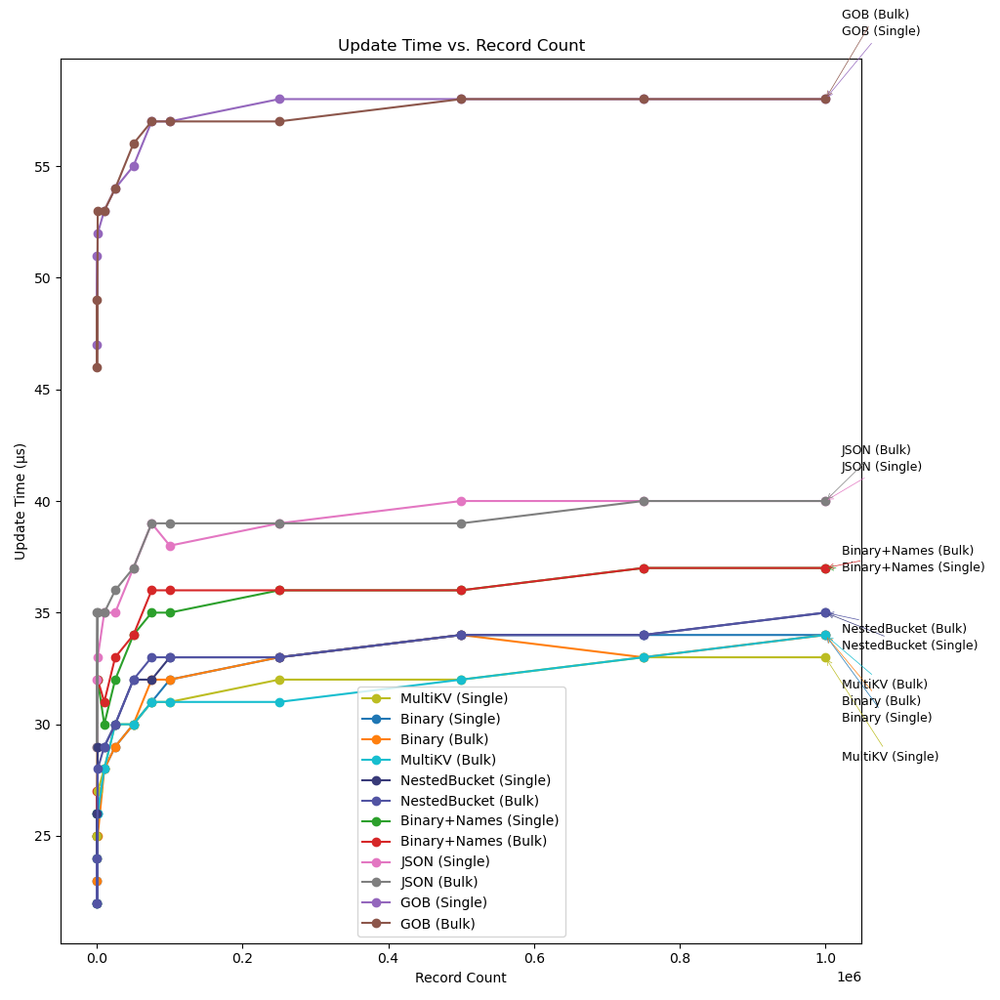
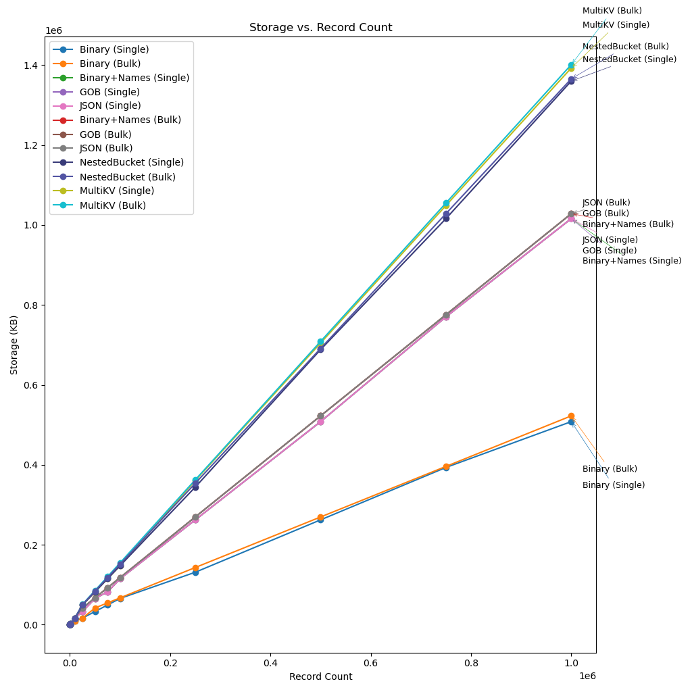

# Experiment 1

The code for this experiment is from commit `78c425c45b189cb710ed1856efb083037ab900d3`

It was run at the following record counts:

- 10, 100, 1_000
- 10_000, 25_000, 50_000, 75_000
- 100_000, 250_000, 500_000, 750_000
- 1_000_000

With 10 runs per scenario and averaging the results.

This took several hours to run.

# Example Data Used

```go
func generateUser(id int64) *UserInfo {
	rand.Seed(id)
	return &UserInfo{
		ID:          id,
		Username:    fmt.Sprintf("user_%d", id),
		Email:       fmt.Sprintf("user%d@example.com", id),
		FirstName:   fmt.Sprintf("First_%d", id),
		LastName:    fmt.Sprintf("Last_%d", id),
		Age:         int32(rand.Intn(60) + 18),
		Height:      float32(150 + rand.Intn(50)),
		Weight:      float32(50 + rand.Intn(100)),
		Balance:     rand.Float64() * 10000,
		IsActive:    rand.Intn(2) == 1,
		CreatedAt:   time.Now().Unix() - int64(rand.Intn(365*24*3600)),
		UpdatedAt:   time.Now().Unix(),
		LoginCount:  int32(rand.Intn(1000)),
		Score:       rand.Float64() * 100,
		Description: fmt.Sprintf("This is a description for user %d with some random text to make it longer and more realistic.", id),
	}
}
```

# Scenarios Tested

We test six strategies of storage:

- Binary:  
  Each entry is stored as a single KV pair.  
  Key is the ID.  
  Value is the struct field encoded as binary and concatenated.  
  Like `Field1Value Field2Value Field3Value`  
  This method is the most storage efficient.
- Binary+Names:  
  Each entry is stored as a single KV pair.  
  Key is the ID.  
  For value, the field's name and value are encoded into bytes and concatenated like:  
  `Field1Name Field1Value Field2Name Field2Value Field3Name Field3Value`  
  This method tries to simulate what Json/Gob is doing, but with no delimiters.
- JSON:  
  Each entry is stored as a single KV pair.  
  Key is the ID.  
  Value is the JSON encoding of the struct.
- Gob:  
  Each entry is stored as a single KV pair.  
  Key is the ID.  
  Value is the Gob encoding of the struct.
- MultiKV:  
  Each entry is stored as a series of KV pairs like:  
  `ID1 Field1Name -> Field1Value`  
  `ID1 Field2Name -> Field2Value`  
  `ID2 Field1Name -> Field1Value`  
  `ID2 Field2Name -> Field2Value`
- NestedBuckets:  
  Each entry is stored under a nested bucket.  
  `ID -> Nested Bucket`  
  Nested Bucket consists of one KV pair per field: `Field name -> Field value`.

For each of these strategies we further test two variants:

- Entries are inserted at one entry per transaction.
- All entries are inserted in a single transaction.

This is to check if the method of insertion causes the data layout to be different, potentially affecting the results.

For each case of (Strategy, Insertion Mode) pair, we conduct the following tests:

Let N be the number of records in the DB.

- Read:  
  Read N/2 random records, one per transaction.
- ReadMany:  
  Read N/3 consecutive records, starting from the middle of the DB.
- FieldSum:  
  Find the sum of a field by iterating through the entire database.
- Update:
  Update a single field for N/2 random records, one update per transaction.
- Storage:  
  On disk size of the database.

For all of the tests except storage, time per single record is reported.  
This is obtained by dividing the total time taken by the number of records.

# Results

## Write


**Analysis**

- Inserting one record per transaction takes about 30-50us per record.  
  In a typical web server, it is common to insert less than 10 records per transaction, so the insertion performance will be close to this than bulk insertion.
- Inserting all records in a single transaction takes about 2-10us, except for NestedBucket and MultiKV methods.
- Having too many keys or nested buckets severly affect the write performance.
  - NestedBucket (Bulk) has the worst insert time of 50us.
  - MultiKV (Bulk) has the insert time of 32us, which is close to JSON (Single) at 34us.
  - These are worse than inserting a single record per transaction using other encodings, including Gob.  
    It will be apparent that Gob is the slowest encoding from the tests that follow below.
- I expected write time per record to go down, as the transaction cost is amortized across more records.  
  But it turns out that this is only true for approx the first 1000 records.  
  After that it's very close to the asymptote and no improvement can be seen.  
  In fact, it increases slightly with the database size, possibly because of increase in the depth of the B+ Tree.  
  This is supported by the insertion time going up significantly for MultiKV and NestedBucket encodings.
- Gob consistently performs worse than JSON.
- JSON and Binary+Names stragies are very close.
- Binary encoding performs the best, as expected.

## Read


**Analysis**

- Gob is very slow. >3x as slow as JSON which is the next worst performer.
- Bulk vs Single insert mode doesn't affect the read performance.
- MultiKV and NestedBuckets have very similar performance.  
  This could be because we are only reading one bucket per-transaction, with atmost one sub bucket indirection per transaction.
- Binary encoding performs the best, as expected.

## ReadMany


**Analysis**

- Gob continues to be very slow. Now almost 3.75x as slow as JSON which is the next worst performer.
- Bulk vs Single insert mode doesn't affect the read performance.
- MultiKV and NestedBuckets performances now diverge.
  This is could be because of the sub-bucket indirection cost becoming more dominant as we access many in a single transaction.
- MultiKV and Binary encodings have the same performance in this scenario.  
  MultiKV is faster than Binary+Names encoding, despite both of them storing the full field names.  
  This shows that accessing consecutive KV pairs are as fast as, if all of their values were crammed into a single KV pair.  
  I don't understand how MultiKV is faster than Binary+Names though, as both of them have to dispatch on the field names to decode the field values.

## FieldSum


**Analysis**

- Gob continues to be very slow.
- The results are very similar to the ReadMany case, except that NestedBucket is now as fast MultiKV and Binary.
  Apparently, accessing a single field from a nested bucket is as fast as accessing a single field using the MultiKV encoding.
- Interestingly, Binary encoding is also as fast as MultiKV encoding.  
  It looks like deserializing the entire record is very cheap when using the Binary encoding.

## Update



**Analysis**

- Gob continues to be very slow. Approx. 2x as slow as the best encoding and approx. 1.5x as slow as the second worst encoding.
- MultiKV (Bulk) performs slightly better than Binary (Bulk/Single) and MultiKV (Single) at 1M records.  
  No other encoding has this descrepancy between Bulk/Single insertion modes. But this is a very minor difference.
  NestedBucket (Single/Bulk) is very close to these two encodings.

## Storage



**Analysis**

- MultiKV and NestedBuckets have the worst storage efficiency because they store the field names.
- Interestingly, JSON, Gob, Binary+Names performs better than MultiKV and NestedBuckets.  
  This could be because in MultiKV and NestedBuckets there are more KV pairs (num records \* num fields).
- As expected, the binary encoding is very efficient. 2x better than the next best encoding and 3x better than the worst encoding.

## Overall thoughts

- Gob has worse encoding/decoding performance than JSON, while taking almost the same space in storage.
- NestedBucket and MultiKV encodings have the worst write performance.
- JSON is a decent choice for storing records in BoltDB.
- It is not worth inventing a custom Binary+Names encoding. Its performance is comparable to JSON.
- The best performance can be obtained by keeping most of the data of a record in a single KV pair, while extracting a few commonly updated fields out to their own KV pairs.
- To squeeze out maximum performance, use custom binary encoding where field names are omitted and field values are tightly packed.  
  For small records upto 200-300 bytes in size, paying the serialization/deserialization overhead to update a single field can be faster than updating a single field in NestedBucket or MultiKV encoding.
